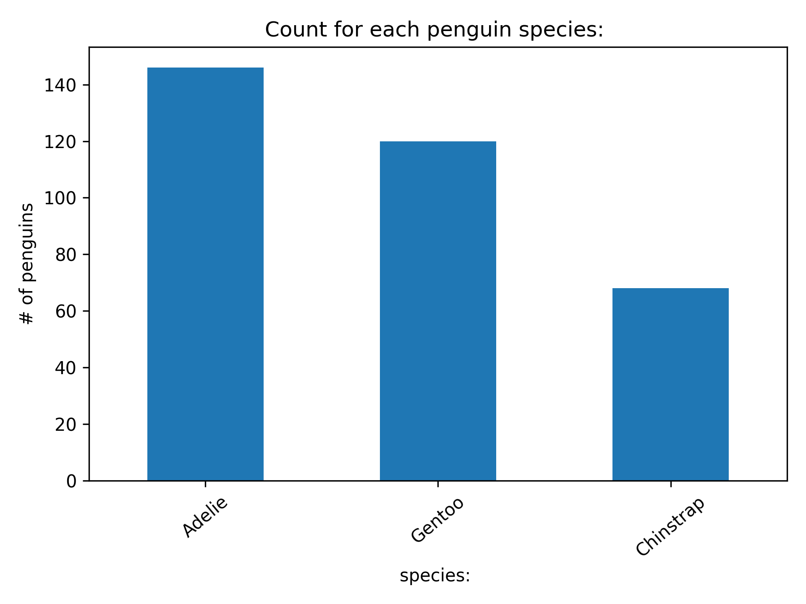

# Analysis of body mass using the measurements for penguins

## Research Question
How do Penguin measurements differ by species, island, and body size? 

## Dataset 
This project uses the Palmer Archipelago Penguin dataset from Kaggle.
- Kaggle link: [Palmer Archipelago Dataset](https://www.kaggle.com/datasets/parulpandey/palmer-archipelago-antarctica-penguin-data)
- Author of the dataset: Parul Pandey

## Folder Structure 
- `data/`
  - `penguins_size.csv` -- Final dataset downloaded from Kaggle
  - `penguins.csv` -- Test document for inital analysis
- `ouputs/`
  - `penguins_size_clean.csv`
- `figures/`
  - `` -- Explains the relationship between the bodymass and the species identity
- `code/` -- All our preprocessing, training, testing scripts are in this folder. 

## Sample Analysis results 


## Results Analysis
|Research Question|Graph or output|
|---|---|
|Which species appear most often?|`species_count_bar.png`|

## Instructions to run
1. Clone the repo
2. Install the packages `matplotlib`, `pandas`, `pathlib`
3. Run the scripts
```bash
python code/data_inspection.py
python code/data_anlaysis.py
```

